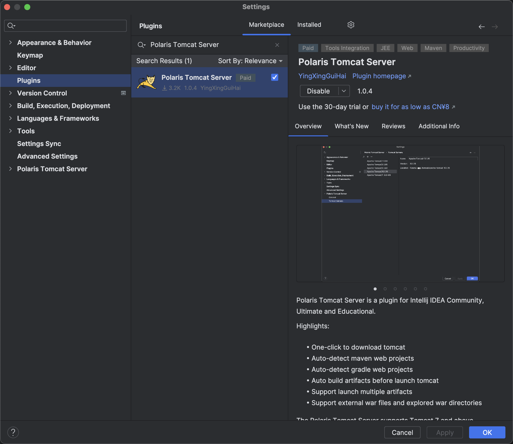
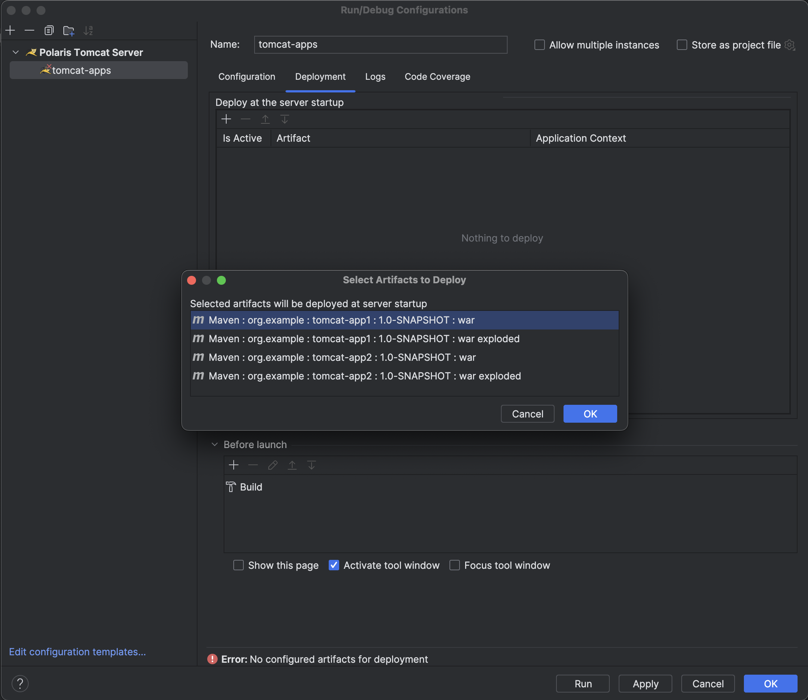

- [Overview](#overview)
- [Getting Started](#getting-started)
- [Release Notes](#release-notes)

# Overview
[Polaris Tomcat Server](https://plugins.jetbrains.com/plugin/22429-polaris-tomcat-server) is a plugin for Intellij IDEA Community, Ultimate and Educational.  

Highlights:
- One-click to download tomcat
- Auto-detect maven web projects
- Auto-detect gradle web projects
- Auto build artifacts before launch tomcat
- Support launch multiple artifacts
- Support external war files and explored war directories

The Polaris Tomcat Server supports Tomcat 7 and above.

# Getting Started
### 1. Install PolarisTomcatServer
Search and install PolarisTomcatServer in Intellij IDEA plugin marketplace.

### 2. Download or add tomcat server
Go to Settings -> Polaris Tomcat Server -> click Download button to download tomcat server or Add button to add tomcat servers from local disk

### 3. Add a PolarisTomcatServer configuration
Go to Edit Configuration -> Add New Configuration -> Click Polaris Tomcat Server to add a PolarisTomcatServer configuration

### 4. Configure tomcat settings
Configure tomcat settings in `Configuration` tab.

### 5. Select war artifacts
Go to `Deployment` tab, add war artifacts from web projects or war file.

# Release Notes
## [1.0.4] - 2023-12-02
- **[Feature]** Support run tomcat from context (right click menu and main class/method gutter) for web app modules.
- **[Feature]** Support web facet and artifacts
- **[Feature]** Support build artifacts with Intellij APIs.
- **[Feature]** Support filter conditions in download tomcat dialog.
- **[Feature]** Support multiline modifications for artifacts deployment table.
- **[Fix]** Apply button remains enabled after being pressed.
- **[Fix]** Configuration modifications will also modify the configuration template.
- **[Fix]** Some display issues.
## [1.0.1] - 2023-08-14
- **[Fix]** webapp on root context path could not update properly for tomcat 7.x.
- **[Fix]** bugs on windows platform.
- **[Fix]** issue that browser url not changes after port changed.

## [1.0.0] - 2023-08-13
- **[Feature]** One-click to download tomcat
- **[Feature]** Auto-detect maven web projects 
- **[Feature]** Auto-detect gradle web projects 
- **[Feature]** Auto build artifacts before launch 
- **[Feature]** Support launch multiple artifacts 
- **[Feature]** Support external war files and explored war directories

